# 5.2. Designing the Database

Beginning by making notes of all objects required in the database led to the initial design, which was further normalised to avoid any unnecessary duplication of data and keep it consistent throughout the database. Foreign keys will be used throughout to create meaningful relationships where two tables represent the same column properties. Composite keys will also be used to represent more complex objects in the database. The tables and the columns that make them up can be seen below:

<figure><figcaption><p>The “Days” table, used to store the days of the week.</p></figcaption></figure>

<figure>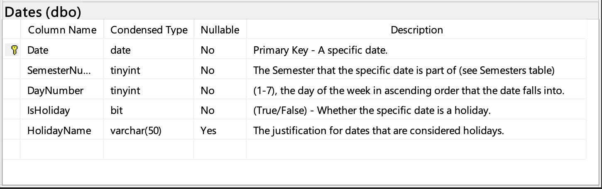<figcaption><p>The “Dates” table, used to store dates for which attendances can be recorded.</p></figcaption></figure>

<figure>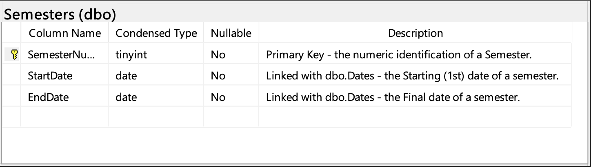<figcaption><p>The “Semesters” table, used to organise different dates.</p></figcaption></figure>

<figure>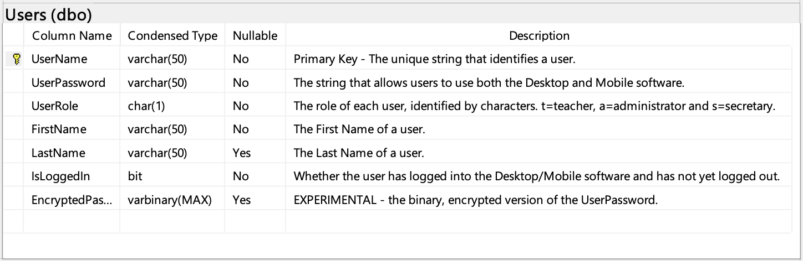<figcaption><p>The “Users” table, where information on different users can be stored.</p></figcaption></figure>

<figure>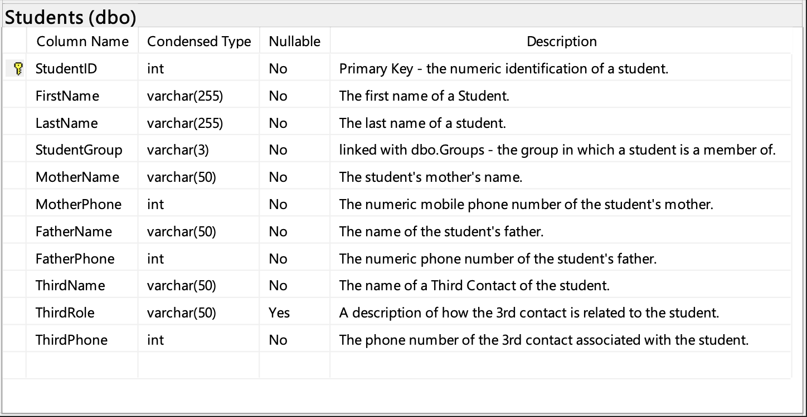<figcaption><p>The “Students” table, where different student information can be stored.</p></figcaption></figure>

<figure>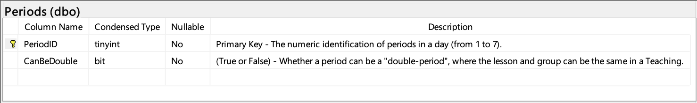<figcaption><p>The “Periods” table, where the 7 periods of each day can be stored individually (three of which can indicate a double-period where the lesson for students remains the same).</p></figcaption></figure>

<figure>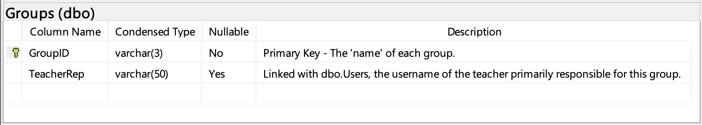<figcaption><p>The “Groups” table, used to assign students and thus teacher timetables to particular groups (each teacher can only be teaching one group per period).</p></figcaption></figure>

<figure>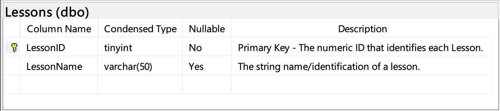<figcaption><p>The “Lessons” table, where each lesson of the school will be stored to create teacher timetables.</p></figcaption></figure>

<figure>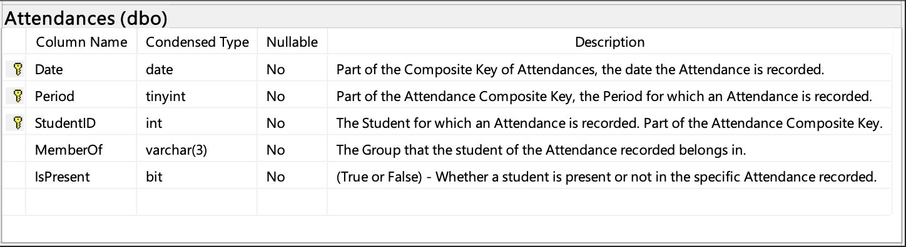<figcaption><p>The “Attendances” table, where the register of all timetables will be stored for each period, student and date.</p></figcaption></figure>

<figure>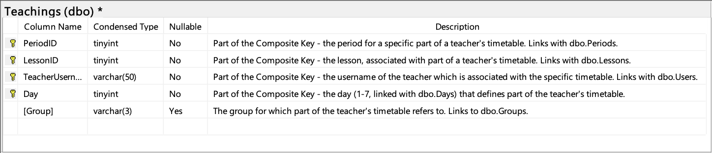<figcaption><p>The “Teachings” table, where teacher timetables will be imported to. Each teacher may generate up to 7periods x 5days = 35 rows according to their timetable.</p></figcaption></figure>

<figure>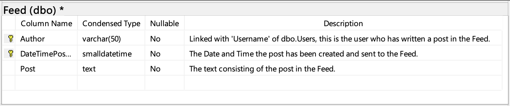<figcaption><p>The “Feed” table, used to store all update posts Administrators and Secretaries create through the Desktop Application.</p></figcaption></figure>

The following script was implemented after finalising the Database Design and can be used to create additional databases functioning as different schools. All the databases can be stored in a singular or multiple SQL Servers which may either be local or on the cloud. To implement the relationships, Microsoft’s SQL Server Management Studio was used for an easier to use GUI experience.

```sql
/****** Object:  Database [aradippou5]    Script Date: 05-Feb-21 11:46:33 AM ******/

CREATE DATABASE [aradippou5]  (EDITION = 'Standard', SERVICE_OBJECTIVE = 'S0', MAXSIZE = 250 GB) WITH CATALOG_COLLATION = SQL_Latin1_General_CP1_CI_AS;

GO

ALTER DATABASE [aradippou5] SET COMPATIBILITY_LEVEL = 150

GO

ALTER DATABASE [aradippou5] SET ANSI_NULL_DEFAULT OFF

GO

ALTER DATABASE [aradippou5] SET ANSI_NULLS OFF

GO

ALTER DATABASE [aradippou5] SET ANSI_PADDING OFF

GO

ALTER DATABASE [aradippou5] SET ANSI_WARNINGS OFF

GO

ALTER DATABASE [aradippou5] SET ARITHABORT OFF

GO

ALTER DATABASE [aradippou5] SET AUTO_SHRINK OFF

GO

ALTER DATABASE [aradippou5] SET AUTO_UPDATE_STATISTICS ON

GO

ALTER DATABASE [aradippou5] SET CURSOR_CLOSE_ON_COMMIT OFF

GO

ALTER DATABASE [aradippou5] SET CONCAT_NULL_YIELDS_NULL OFF

GO

ALTER DATABASE [aradippou5] SET NUMERIC_ROUNDABORT OFF

GO

ALTER DATABASE [aradippou5] SET QUOTED_IDENTIFIER OFF

GO

ALTER DATABASE [aradippou5] SET RECURSIVE_TRIGGERS OFF

GO

ALTER DATABASE [aradippou5] SET AUTO_UPDATE_STATISTICS_ASYNC OFF

GO

ALTER DATABASE [aradippou5] SET ALLOW_SNAPSHOT_ISOLATION ON

GO

ALTER DATABASE [aradippou5] SET PARAMETERIZATION SIMPLE

GO

ALTER DATABASE [aradippou5] SET READ_COMMITTED_SNAPSHOT ON

GO

ALTER DATABASE [aradippou5] SET  MULTI_USER

GO

ALTER DATABASE [aradippou5] SET ENCRYPTION ON

GO

ALTER DATABASE [aradippou5] SET QUERY_STORE = ON

GO

ALTER DATABASE [aradippou5] SET QUERY_STORE (OPERATION_MODE = READ_WRITE, CLEANUP_POLICY = (STALE_QUERY_THRESHOLD_DAYS = 30), DATA_FLUSH_INTERVAL_SECONDS = 900, INTERVAL_LENGTH_MINUTES = 60, MAX_STORAGE_SIZE_MB = 100, QUERY_CAPTURE_MODE = AUTO, SIZE_BASED_CLEANUP_MODE = AUTO, MAX_PLANS_PER_QUERY = 200, WAIT_STATS_CAPTURE_MODE = ON)

GO

/*** The scripts of database scoped configurations in Azure should be executed inside the target database connection. ***/

GO

-- ALTER DATABASE SCOPED CONFIGURATION SET MAXDOP = 8;

GO

/****** Object:  Table [dbo].[Attendances]    Script Date: 05-Feb-21 11:46:34 AM ******/

SET ANSI_NULLS ON

GO

SET QUOTED_IDENTIFIER ON

GO

CREATE TABLE [dbo].[Attendances](

     [Date] [date] NOT NULL,

     [Period] [tinyint] NOT NULL,

     [StudentID] [int] NOT NULL,

     [MemberOf] [varchar](3) NOT NULL,

     [IsPresent] [bit] NOT NULL,

 CONSTRAINT [PK_Attendances] PRIMARY KEY CLUSTERED

(

     [Date] ASC,

     [Period] ASC,

     [StudentID] ASC

)WITH (STATISTICS_NORECOMPUTE = OFF, IGNORE_DUP_KEY = OFF, OPTIMIZE_FOR_SEQUENTIAL_KEY = OFF) ON [PRIMARY]

) ON [PRIMARY]

GO

/****** Object:  Table [dbo].[Dates]    Script Date: 05-Feb-21 11:46:34 AM ******/

SET ANSI_NULLS ON

GO

SET QUOTED_IDENTIFIER ON

GO

CREATE TABLE [dbo].[Dates](

     [Date] [date] NOT NULL,

     [SemesterNumber] [tinyint] NOT NULL,

     [DayNumber] [tinyint] NOT NULL,

     [IsHoliday] [bit] NOT NULL,

     [HolidayName] [varchar](50) NULL,

 CONSTRAINT [PK_Dates] PRIMARY KEY CLUSTERED

(

     [Date] ASC

)WITH (STATISTICS_NORECOMPUTE = OFF, IGNORE_DUP_KEY = OFF, OPTIMIZE_FOR_SEQUENTIAL_KEY = OFF) ON [PRIMARY]

) ON [PRIMARY]

GO

/****** Object:  Table [dbo].[Days]    Script Date: 05-Feb-21 11:46:34 AM ******/

SET ANSI_NULLS ON

GO

SET QUOTED_IDENTIFIER ON

GO

CREATE TABLE [dbo].[Days](

     [DayNumber] [tinyint] NOT NULL,

     [DayString] [varchar](50) NOT NULL,

     [IsWorkDay] [bit] NOT NULL,

 CONSTRAINT [PK_Days] PRIMARY KEY CLUSTERED

(

     [DayNumber] ASC

)WITH (STATISTICS_NORECOMPUTE = OFF, IGNORE_DUP_KEY = OFF, OPTIMIZE_FOR_SEQUENTIAL_KEY = OFF) ON [PRIMARY]

) ON [PRIMARY]

GO

/****** Object:  Table [dbo].[Feed]    Script Date: 05-Feb-21 11:46:34 AM ******/

SET ANSI_NULLS ON

GO

SET QUOTED_IDENTIFIER ON

GO

CREATE TABLE [dbo].[Feed](

     [Author] [varchar](50) NOT NULL,

     [DateTimePosted] [smalldatetime] NOT NULL,

     [Post] [text] NOT NULL,

 CONSTRAINT [PK_Feed] PRIMARY KEY CLUSTERED

(

     [Author] ASC,

     [DateTimePosted] ASC

)WITH (STATISTICS_NORECOMPUTE = OFF, IGNORE_DUP_KEY = OFF, OPTIMIZE_FOR_SEQUENTIAL_KEY = OFF) ON [PRIMARY]

) ON [PRIMARY] TEXTIMAGE_ON [PRIMARY]

GO

/****** Object:  Table [dbo].[Groups]    Script Date: 05-Feb-21 11:46:34 AM ******/

SET ANSI_NULLS ON

GO

SET QUOTED_IDENTIFIER ON

GO

CREATE TABLE [dbo].[Groups](

     [GroupID] [varchar](3) NOT NULL,

     [TeacherRep] [varchar](50) NULL,

 CONSTRAINT [PK_Groups] PRIMARY KEY CLUSTERED

(

     [GroupID] ASC

)WITH (STATISTICS_NORECOMPUTE = OFF, IGNORE_DUP_KEY = OFF, OPTIMIZE_FOR_SEQUENTIAL_KEY = OFF) ON [PRIMARY]

) ON [PRIMARY]

GO

/****** Object:  Table [dbo].[Lessons]    Script Date: 05-Feb-21 11:46:34 AM ******/

SET ANSI_NULLS ON

GO

SET QUOTED_IDENTIFIER ON

GO

CREATE TABLE [dbo].[Lessons](

     [LessonID] [tinyint] NOT NULL,

     [LessonName] [varchar](50) NULL,

 CONSTRAINT [PK_Lessons] PRIMARY KEY CLUSTERED

(

     [LessonID] ASC

)WITH (STATISTICS_NORECOMPUTE = OFF, IGNORE_DUP_KEY = OFF, OPTIMIZE_FOR_SEQUENTIAL_KEY = OFF) ON [PRIMARY]

) ON [PRIMARY]

GO

/****** Object:  Table [dbo].[Periods]    Script Date: 05-Feb-21 11:46:34 AM ******/

SET ANSI_NULLS ON

GO

SET QUOTED_IDENTIFIER ON

GO

CREATE TABLE [dbo].[Periods](

     [PeriodID] [tinyint] NOT NULL,

     [CanBeDouble] [bit] NOT NULL,

 CONSTRAINT [PK_Periods] PRIMARY KEY CLUSTERED

(

     [PeriodID] ASC

)WITH (STATISTICS_NORECOMPUTE = OFF, IGNORE_DUP_KEY = OFF, OPTIMIZE_FOR_SEQUENTIAL_KEY = OFF) ON [PRIMARY]

) ON [PRIMARY]

GO

/****** Object:  Table [dbo].[Semesters]    Script Date: 05-Feb-21 11:46:34 AM ******/

SET ANSI_NULLS ON

GO

SET QUOTED_IDENTIFIER ON

GO

CREATE TABLE [dbo].[Semesters](

     [SemesterNumber] [tinyint] NOT NULL,

     [StartDate] [date] NOT NULL,

     [EndDate] [date] NOT NULL,

 CONSTRAINT [PK_Semesters] PRIMARY KEY CLUSTERED

(

     [SemesterNumber] ASC

)WITH (STATISTICS_NORECOMPUTE = OFF, IGNORE_DUP_KEY = OFF, OPTIMIZE_FOR_SEQUENTIAL_KEY = OFF) ON [PRIMARY]

) ON [PRIMARY]

GO

/****** Object:  Table [dbo].[Students]    Script Date: 05-Feb-21 11:46:34 AM ******/

SET ANSI_NULLS ON

GO

SET QUOTED_IDENTIFIER ON

GO

CREATE TABLE [dbo].[Students](

     [StudentID] [int] IDENTITY(1,1) NOT NULL,

     [FirstName] [varchar](255) NOT NULL,

     [LastName] [varchar](255) NOT NULL,

     [StudentGroup] [varchar](3) NOT NULL,

     [MotherName] [varchar](50) NOT NULL,

     [MotherPhone] [int] NOT NULL,

     [FatherName] [varchar](50) NOT NULL,

     [FatherPhone] [int] NOT NULL,

     [ThirdName] [varchar](50) NOT NULL,

     [ThirdRole] [varchar](50) NULL,

     [ThirdPhone] [int] NOT NULL,

 CONSTRAINT [PK_Students] PRIMARY KEY CLUSTERED

(

     [StudentID] ASC

)WITH (STATISTICS_NORECOMPUTE = OFF, IGNORE_DUP_KEY = OFF, OPTIMIZE_FOR_SEQUENTIAL_KEY = OFF) ON [PRIMARY]

) ON [PRIMARY]

GO

/****** Object:  Table [dbo].[Teachings]    Script Date: 05-Feb-21 11:46:34 AM ******/

SET ANSI_NULLS ON

GO

SET QUOTED_IDENTIFIER ON

GO

CREATE TABLE [dbo].[Teachings](

     [PeriodID] [tinyint] NOT NULL,

     [LessonID] [tinyint] NOT NULL,

     [TeacherUsername] [varchar](50) NOT NULL,

     [Day] [tinyint] NOT NULL,

     [Group] [varchar](3) NULL,

 CONSTRAINT [PK_Teachings] PRIMARY KEY CLUSTERED

(

     [PeriodID] ASC,

     [LessonID] ASC,

     [TeacherUsername] ASC,

     [Day] ASC

)WITH (STATISTICS_NORECOMPUTE = OFF, IGNORE_DUP_KEY = OFF, OPTIMIZE_FOR_SEQUENTIAL_KEY = OFF) ON [PRIMARY]

) ON [PRIMARY]

GO

/****** Object:  Table [dbo].[Users]    Script Date: 05-Feb-21 11:46:34 AM ******/

SET ANSI_NULLS ON

GO

SET QUOTED_IDENTIFIER ON

GO

CREATE TABLE [dbo].[Users](

     [UserName] [varchar](50) NOT NULL,

     [UserPassword] [varchar](50) NOT NULL,

     [UserRole] [char](1) NOT NULL,

     [FirstName] [varchar](50) NOT NULL,

     [LastName] [varchar](50) NULL,

     [IsLoggedIn] [bit] NOT NULL,

 CONSTRAINT [PK_Users] PRIMARY KEY CLUSTERED

(

     [UserName] ASC

)WITH (STATISTICS_NORECOMPUTE = OFF, IGNORE_DUP_KEY = OFF, OPTIMIZE_FOR_SEQUENTIAL_KEY = OFF) ON [PRIMARY]

) ON [PRIMARY]

GO

ALTER TABLE [dbo].[Dates] CHECK CONSTRAINT [DateSemesterLink]

GO

ALTER TABLE [dbo].[Feed]  WITH CHECK ADD  CONSTRAINT [FeedAuthorLink] FOREIGN KEY([Author])

REFERENCES [dbo].[Users] ([UserName])

GO

ALTER TABLE [dbo].[Feed] CHECK CONSTRAINT [FeedAuthorLink]

GO

ALTER TABLE [dbo].[Groups]  WITH CHECK ADD  CONSTRAINT [GroupsRepLink] FOREIGN KEY([TeacherRep])

REFERENCES [dbo].[Users] ([UserName])

GO

ALTER TABLE [dbo].[Groups] CHECK CONSTRAINT [GroupsRepLink]

GO

ALTER TABLE [dbo].[Students]  WITH CHECK ADD  CONSTRAINT [StudentsGroupsLink] FOREIGN KEY([StudentGroup])

REFERENCES [dbo].[Groups] ([GroupID])

GO

ALTER TABLE [dbo].[Students] CHECK CONSTRAINT [StudentsGroupsLink]

GO

ALTER TABLE [dbo].[Teachings]  WITH CHECK ADD  CONSTRAINT [TeachingsDaysLink] FOREIGN KEY([Day])

REFERENCES [dbo].[Days] ([DayNumber])

GO

ALTER TABLE [dbo].[Teachings] CHECK CONSTRAINT [TeachingsDaysLink]

GO

ALTER TABLE [dbo].[Teachings]  WITH CHECK ADD  CONSTRAINT [TeachingsGroupsLink] FOREIGN KEY([Group])

REFERENCES [dbo].[Groups] ([GroupID])

GO

ALTER TABLE [dbo].[Teachings] CHECK CONSTRAINT [TeachingsGroupsLink]

GO

ALTER TABLE [dbo].[Teachings]  WITH CHECK ADD  CONSTRAINT [TeachingsLessonsLink] FOREIGN KEY([LessonID])

REFERENCES [dbo].[Lessons] ([LessonID])

GO

ALTER TABLE [dbo].[Teachings] CHECK CONSTRAINT [TeachingsLessonsLink]

GO

ALTER TABLE [dbo].[Teachings]  WITH CHECK ADD  CONSTRAINT [TeachingsPeriodsLink] FOREIGN KEY([PeriodID])

REFERENCES [dbo].[Periods] ([PeriodID])

GO

ALTER TABLE [dbo].[Teachings] CHECK CONSTRAINT [TeachingsPeriodsLink]

GO

ALTER TABLE [dbo].[Teachings]  WITH CHECK ADD  CONSTRAINT [TeachingsTeacherLink] FOREIGN KEY([TeacherUsername])

REFERENCES [dbo].[Users] ([UserName])

GO

ALTER TABLE [dbo].[Teachings] CHECK CONSTRAINT [TeachingsTeacherLink]

GO

ALTER DATABASE [aradippou5] SET  READ_WRITE

GO
```

The code above may be used as many times as needed in a singular SQL Server to re-create the same structure multiple times for different schools. The name of each database would have to be altered only, since the solution looks for preset table names like “users” and cannot check for alternatives.

The relationships created for the tables can be represented in the graph below:

<figure>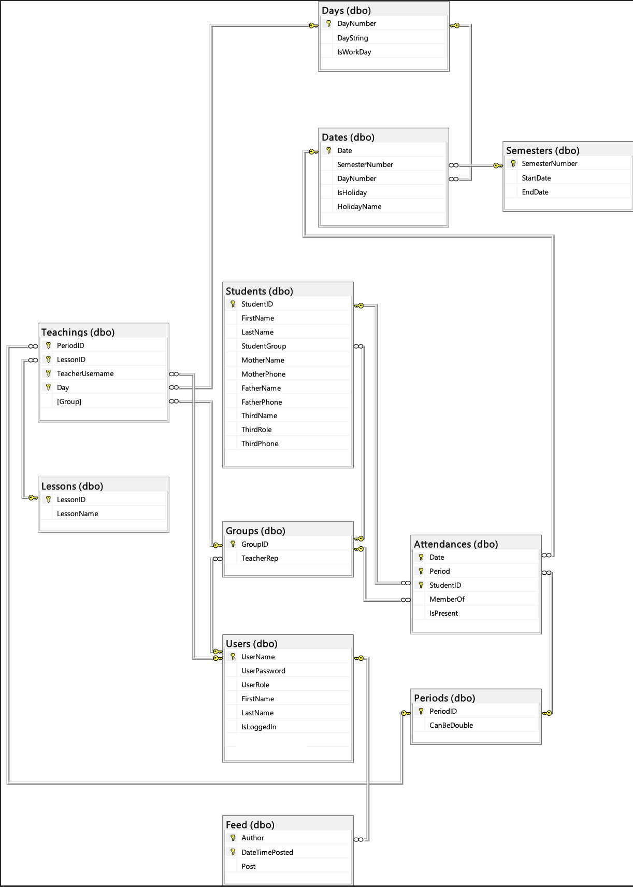<figcaption><p>Table Relationships</p></figcaption></figure>
