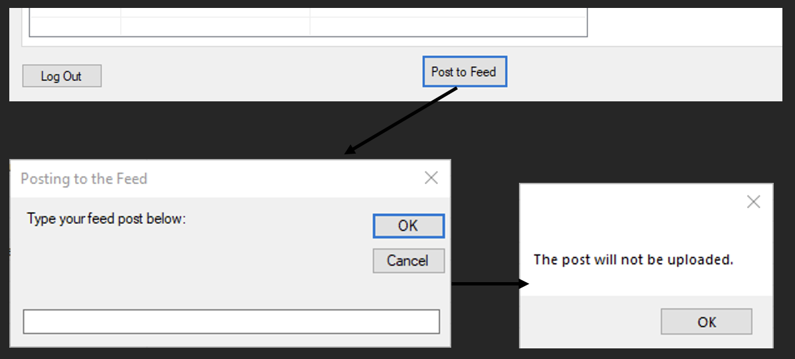

# Evidence of Testing

### **Test 1:**

Checking that a connection to the database can be established with the correct database URL and Password:

<figure><figcaption></figcaption></figure>

### **Test 2:**

Checking that the appropriate error message is displayed if the connection to the database cannot be established.

<figure><figcaption></figcaption></figure>

### **Test 3:**

Checking that a valid username and password combination is accepted when signing in.

<figure><figcaption></figcaption></figure>

### **Test 4:**

Checking that an invalid username and password combination is rejected when signing in.

<figure><figcaption></figcaption></figure>

### Test 5:

Checking that if the correct user credentials do not match to an administrator or secretary account, access to the Administrator Form is denied.te

<figure><figcaption></figcaption></figure>

### Test 6:

Checking that the combination of correct credentials, along with the user type administrator or secretary hides the Log In form and displays the Administrator form.

<figure><figcaption></figcaption></figure>

### Test 7:

Checking that an appropriate Absent Student list is generated and displayed without choosing a group.

<figure><figcaption></figcaption></figure>

### Test 8:

Checking that an appropriate Absent Student list is generated and displayed given a selected group.

<figure><figcaption></figcaption></figure>

### Test 9:

Checking that a .csv file is generated successfully at the selected file path.

<figure><figcaption></figcaption></figure>

### Test 10:

Checking that a group selected results in the right list of students presented.

<figure><figcaption></figcaption></figure>

### Test 11:

Checking that an error message is displayed when no group is selected to show its member students.

<figure><figcaption></figcaption></figure>

### Test 12:

Check that an error message is displayed when no student is selected to be removed.

<figure><figcaption></figcaption></figure>

### Test 13:

Check that an incorrectly structured .csv file has been selected.

<figure><figcaption></figcaption></figure>

### Test 14:

Checking that a semester’s initial date is not later than the final date selected by the user.

<figure><figcaption></figcaption></figure>

### Test 15:

Checking that all dates are added to the database in the “Semesters” and “Dates” tables.

<figure><figcaption></figcaption></figure>

### Test 16:

Checking that an error message is displayed when no semester is selected to be removed.

<figure><figcaption></figcaption></figure>

### Test 17:

Checking for appropriate error message when no group name was used to add a new group.

<figure><figcaption></figcaption></figure>

### Test 18:

Checking that a group is added when an appropriate name has been entered.

<figure><figcaption></figcaption></figure>

### Test 19:

Checking that an error message is displayed when no group is selected to be removed.

<figure><figcaption></figcaption></figure>

### Test 20:

Checking that a single group and all its member students are deleted successfully.

<figure><figcaption></figcaption></figure>

### Test 21:

Checking that two correctly structured .csv files have been selected.

<figure><figcaption></figcaption></figure>

Contents of test-part1.csv:

```csv
2,0,0,0,2
0,2,0,2,0
0,2,2,0,2
0,0,2,2,0
2,5,3,8,12
5,0,0,8,12
3,0,0,0,0
```

<figure><figcaption></figcaption></figure>

Contents of test-part2.csv:

```csv
E2,NULL,NULL,NULL,E2
NULL,E2,NULL,E2,NULL
NULL,E2,E2,NULL,E2
NULL,NULL,E2,E2,NULL
E2,D1,D1,E2,E2
E2,NULL,NULL,E2,E2
D1,NULL,NULL,NULL,NULL
```

<figure><figcaption></figcaption></figure>

### Test 22:

Checking that a single user has been selected when uploading their schedule.

<figure><figcaption></figcaption></figure>

### Test 23:

Checking that a single user has been selected when changing their password.

<figure><figcaption></figcaption></figure>

### Test 24:

Checking that an empty password was not provided when changing password for a user.

<figure><figcaption></figcaption></figure>

### Test 25:

Inserting the same password twice changes the current password of the user to the new one.

<figure><figcaption></figcaption></figure>

Looking up the user in the users table shows the updated password:

<figure><figcaption></figcaption></figure>

### Test 26:

Inserting different passwords when changing the selected user’s password results in an error message.

<figure><figcaption></figcaption></figure>

### Test 27:

Checking that a single user has been selected when deleting them from the database.

<figure><figcaption></figcaption></figure>

### Test 28:

Selecting “Yes” in the popup window deletes the selected user from the database.

<figure><figcaption></figcaption></figure>

### Test 29:

Selecting “No” in the popup window does not delete the user from the database.

<figure><figcaption></figcaption></figure>

### Test 30:

Checking that a single lesson has been selected when removing it from the database.

<figure><figcaption></figcaption></figure>

### Test 31:

Checking that a numeric ID results to creating a new lesson in the database.

<figure><figcaption><p>The lesson is added to the database and the list of lessons is fetched once again.</p></figcaption></figure>

### Test 32:

Checking that a lesson is not created when a non-numeric lesson ID is provided.

<figure><figcaption></figcaption></figure>

### Test 33:

Checking that a non-empty post text has been provided.

<figure><figcaption></figcaption></figure>

### Test 34:

Checking that the current password and new passwords result in the password being changed.

<figure><figcaption></figcaption></figure>

<figure><figcaption></figcaption></figure>

### Test 35:

Checking that the feed posts are fetched on launch.

<figure><figcaption></figcaption></figure>
